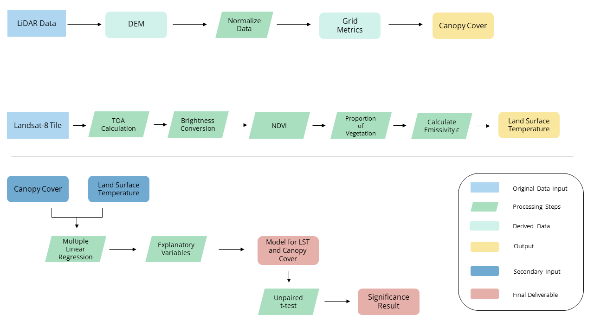

# Understanding Microclimate in University of British Columbia's Botanical Garden
#### Using a multiple linear regression, a model was created to assess land surface temperature and LiDAR metrics.

## Due to size constraints, please visit the [MGEM Scholars Portal Dataverse](https://dataverse.scholarsportal.info/dataverse/UBC_MGEM) to download this project. 

## Intoduction
Microclimate is defined as noticeable climatic conditions that differ from the temperatures outside of forests (De Frenne et. al 2021).

Climate change is a key factor in how extreme weather events affect how ecosystems and species react to these changes in temperatures (Harris et al., 2020).  Urban green spaces are becoming more important in providing resilience to climate change as many tall broad trees provide shade through canopy cover (Cheng et al., 2021). Acknowledging different microclimates is important in maintaining the ecosystem service for species residing or passing through these areas at the botanical gardens. These relief zones can be imperative during heatwaves and during migration or off-seasons, in letting species take comfort (Philpott & Bichier, 2012).  In addition, with climate change altering many species and their ranges, range shifts may occur making these relief zones a new suitable habitat for them to occupy (Valladares et al., 2016).

## Study Area
The UBC Botanical Garden is located on the University of British Columbia Vancouver Campus at latitude 49.25 decimal degrees and -123.25 decimal degrees.
I would like to acknowledge that UBC Botanical Garden is located on the traditional and unceded land of the xʷməθkʷəy̓əm Musqueam First Nation. 
They work towards the vision that plants are understood, valued, celebrated, and secure in a healthy, biodiverse world.
The campus is located in the Moist Maritime Coastal Douglas-fir Subzone (CDFmm) (BEC WEB, n.d.; CDFmm.Pdf, n.d.). It is one of the oldest university botanic gardens and sits at 37 hectares (About Us, n.d.). It was originally established 100 years ago and now hosts many native and non-native cultivated plants.

## Methods
##### Canopy Cover
LiDAR metrics were derived using LiDAR data flown around the UBC Campus in 2021. Canopy cover was calculated in RStudio using the lidR package (Roussel, 2021). LiDAR grid metrics were calculated for first returns only. Trees were filtered to be taller than 2 meters.

##### Land Surface Temperature
A land surface temperature (LST) map was created from calculating LST in ArcGIS Pro. This is a five step process that includes calculating top of atmospheric spectral radiance, a brightness temperature conversion, a Normalized Difference Vegetation Index (NDVI), proportion of vegetation, and emissivity.

#####Modelling Using Multiple Linear Regression
A model was created to analyze land surface temperature with LiDAR metrics on 100 points inside UBC Botanical Garden. Using canopy cover (pzabove2) and the maximum height in the stand (zmaxvalue) in the model led to valuable results. The model was created in RStudio using R programming language. 

##### Workflow Methodology

This is the study’s workflow diagram on canopy cover and microclimate in UBCBG. This is based on using LiDAR and Landsat-8 data. In order to run the multiple linear regression, first canopy cover must be derived and then LST data as seen in yellow.  With these two outputs, they can then be input as a secondary input into running a multiple linear regression that can produce a model for canopy cover, maximum height, and LST—as seen in red. An unpaired t-test is done to further investigate the results from the model to give a significance result. 

## Results
Areas with high canopy cover are represented with a deep dark green and areas without canopy cover are represented in white. Vegetation that has little to no canopy cover is shown in light green. Canopy cover was calculated from LiDAR data flown in 2021

This is a land surface temperature map of UBCBG using Landsat-8 data retrieved on June 30, 2021. On this day, a heat dome extreme weather event was occurring causing extreme high temperatures. You can see the yellow-orange areas reflect cooler temperatures. In areas that have high temperatures, those are reflected in bright red and they look to be correlated with buildings in UBCBG as seen in our study site map. The highest value within the garden is 64.2 °C and the lowest is 58.6°C. It is important to note that LST is different from ambient temperature; where ambient temperature is the temperature of the environment (Land Surface Temperature, 2021).

A model was then created to analyze land surface temperature with LiDAR metrics on 100 random points inside UBC Botanical Garden. Using canopy cover (pzabove2) and the maximum height in the stand (zmaxvalue) in the model led to valuable results. The model was created in RStudio using R programming language. 

## Results

This is the distribution of the pairs of canopy cover and maximum height when paired with land surface temperature. pzabove2va is the LiDAR metric for canopy cover and zmaxvalue is the metric for maximum height. Values ranging from 0-100 on axis represent canopy cover. The maximum height ranges from 0-50 and LST ranges from 58-65. In this figure, you can see they are signficant when paired against the lst value which is the land surface temperature calculation. 

This is the predicted vs. measured plot produced from the model. After running the model with both canopy cover and the maximum height, the correlation between land surface temperature and canopy cover was not significant. This is very interesting! Canopy cover had a p-value of 0.0993. However, the maximum height was significant with land surface temperature with a p-value of 0.0034. The closer points are along the fitted line, the stronger the relationship. Since the R2 value is 0.3409, the model can only explain a 34% variation between the variables tested. 

## Further Investigation of Results
Interesting that canopy cover was not significant in the model! Is there any significance at all between areas with canopy cover and areas without canopy cover?

An unpaired t-test was run to compare the means of the two unrelated groups to determine if there was any difference between the two.  This was done on the 100 random points but one group was trees taller than 2m and the other group was trees below 2m. This represented areas with canopy cover and areas without canopy cover. The t-test showed that the two unrelated groups did have differences as the p-value was 0.003571 which is less than the alpha of 0.05. This means that areas with canopy cover were different from areas without canopy cover. We reject our null hypothesis as the true difference in means is not equal to 0.

## Discussion
LiDAR is becoming more common in understanding the structure of a forest. Canopy cover is important in forests because it buffers understory temperatures (Kašpar et al., 2021). To assess how temperatures are being buffered below the understory, microclimate is an important variable in determining these differences. A study by Kašpar et al. (2021), found that although ground-measured canopy height and cover has been mostly studied, it is impossible to use these metrics in implementation in understanding microclimatic effects over a large spatially continuous area.

Using LST derived from Landsat is an inferior choice as the resolution is very coarse compared to the study area. It is notable in the LST values derived, that initial insights to how canopy cover affected the areas within the study area had lower values than areas where buildings existed. However, due to the 30m coarse resolution of Landsat, it does not provide a good estimation of microclimate. The Kašpar et al (2021) study used microclimate loggers to measure in situ air temperature for their microclimate data. Using fine-scale ground measurements would be beneficial in small study areas as it can represent the area better.

The t-test shows us that there is a difference between areas with and without canopy cover. However, because the model produced low R 2  values and only showed maximum height to be significant, this model is not accurate in assessing how canopy cover influences microclimate. Greiser et al. (2018), suggested that forest management and conservation is a key factor in being able to provide support from the effects of climate change and temperature below the canopy. This can explain why our t-test shows the difference between the two means. Within the UBCBG the cultivated and non-cultivated areas have a variety of canopy cover structure that can explain the t-test results as areas with canopy cover and areas without canopy cover have statistically significant results. Greiser et al. (2018) found that microclimate modelling is still new and needs to be further assessed in managed forested landscapes. 

## Future Reccomendations
Many studies studying microclimate and remote sensing used temperature sensors to understand understory temperatures (Kaspar et al. 2021; Zellweger et. al. 2019). For future work in the UBCBG, installation of temperature loggers throughout garden beds can be beneficial in determining an accurate model between canopy cover and microclimate. The Temperature-Moisture-Sensor (TMS) is a new innovation designed for ecological applications (Wild et al., 2019). It has a large memory and long battery life making it a viable logger in the field. These temperature data loggers can gather microclimate information for years with little to no maintenance and facilitates long-term measurements in vast areas as it is similar in shape and height to a small plant (2019). As it measures temperature and soil moisture, acquiring the TMS in UBCBG would be valuable for prospective studies to come. 

Additionally, to create a model for the UBCBG, sampling random points from the ground to specifically choose areas with canopy cover and areas without canopy cover may be able to show a better understanding of how canopy cover has altered microclimate in the UBCBG. This is due to the 100 random points chosen within the study area being generated on buildings. If field work is not feasible, a generated shapefile excluding buildings may be a solution when creating random sampling points in ArcGIS. As the study area is focused on the Asian Garden, it could be beneficial and interesting to increase the study area to the entire UBCBG. This can increase the random points to create a better sampling within the model and to see what areas are lacking canopy cover within the garden. This would be valuable in ecological restoration and creating new areas for species that reside within the UBCBG during extreme weather temperatures.

Currently, the model provides a practical structure in future assessment of microclimate research within the UBCBG. With these recommendations, the model can be further used in a pragmatic approach in how plants are understood and valued alongside species that take refuge within the garden. As microclimate modelling is advancing, UBC Botanical Garden has potential to advance their understanding of finer resolution temperature scale below canopy in future studies.

## List of Future Reccomendations
- Acquiring Temperature-Moisture-Sensors (TMS) would be beneficial for UBCBG  to assess microclimate in future studies. These are viable in the field as they have long battery life and a large memory storage.
- Field work in ground sampling points can give larger spatial variance within the study area. As there are buildings within UBCBG, ground sampling can exclude these areas to provide better sampling points.
- With field work, ground sampels ca also be used in ground truthing data to provide validation and accuracy to test against models created. With a generated shapefile excluding buildings and structures, random points can be generated similarly to this study to create a model. Then, this data can be validated and tested for accuracy against a model using ground samples.

## Bibliography

####About Us—UBC Botanical Garden. (n.d.).
####Retrieved April 1, 2022, from  https://botanicalgarden.ubc.ca/about/about-us/ 
####BEC WEB. (n.d.). Retrieved April 1,
####2022, from  https://www.for.gov.bc.ca/hre/becweb/resources/classificationreports/subzones/index.html 
####CDFmm.pdf. (n.d.). Retrieved April 1, 2022, from  https://www.for.gov.bc.ca/hre/becweb/Downloads/Downloads_SubzoneReports/CDFmm.pdf 
####Cheng, Y. (Daniel), Farmer, J. R., Dickinson, S.
####L., Robeson, S. M., Fischer, B. C., & Reynolds, H. L. (2021). Climate
####change impacts and urban green space adaptation efforts: Evidence from U.S.
####municipal parks and recreation departments. Urban Climate, 39,
####100962.  https://doi.org/10.1016/j.uclim.2021.100962 
####De Frenne, P., Lenoir, J., Luoto, M., Scheffers, B.
####R., Zellweger, F., Aalto, J., Ashcroft, M. B., Christiansen, D. M., Decocq, G.,
####De Pauw, K., Govaert, S., Greiser, C., Gril, E., Hampe, A., Jucker, T., Klinges,
####D. H., Koelemeijer, I. A., Lembrechts, J. J., Marrec, R., … Hylander, K.
####(2021). Forest microclimates and climate change: Importance, drivers and future
####research agenda. Global Change Biology, 27(11), 2279–2297.  https://doi.org/10.1111/gcb.15569 
####Greiser, C., Meineri, E., Luoto, M., Ehrlén, J.,
####& Hylander, K. (2018). Monthly microclimate models in a managed boreal
####forest landscape. Agricultural and Forest Meteorology, 250–251,
####147–158.  https://doi.org/10.1016/j.agrformet.2017.12.252 
####Harris, R. M. B., Loeffler, F., Rumm, A., Fischer, C., Horchler, P., Scholz, M., Foeckler, F., & Henle, K. (2020). Biological responses to extreme weather events ####are detectable but difficult to formally attribute to anthropogenic climate change. Scientific Reports, 10(1), 14067. https://doi.org/10.1038/s41598-020-70901-6

Kašpar, V., Hederová, L., Macek, M., Müllerová, J.,
Prošek, J., Surový, P., Wild, J., & Kopecký, M. (2021). Temperature
buffering in temperate forests: Comparing microclimate models based on ground
measurements with active and passive remote sensing. Remote Sensing of
Environment, 263, 112522.  https://doi.org/10.1016/j.rse.2021.112522 
Land Surface Temperature. (2021, December 31). [Text.Article]. NASA Earth Observatory. https://earthobservatory.nasa.gov/global-maps/MOD_LSTD_M

Philpott, S. M., & Bichier, P. (2012). Effects
of shade tree removal on birds in coffee agroecosystems in Chiapas, Mexico. Agriculture,
Ecosystems & Environment, 149, 171–180.  https://doi.org/10.1016/j.agee.2011.02.015 
Roussel, J.-R., Tompalski, P., & Goodbody, T.
R. H. (n.d.). The lidR package. Retrieved April 1, 2022, from  https://r-lidar.github.io/lidRbook/ 
Valladares, F., Laanisto, L., Niinemets, Ü., & Zavala, M. A. (2016). Shedding light on shade: Ecological perspectives of understorey plant life. Plant Ecology & Diversity, 9(3), 237–251.  https://doi.org/10.1080/17550874.2016.1210262 
Wild, J., Kopecký, M., Macek, M., Šanda, M., Jankovec, J., & Haase, T. (2019). Climate at ecologically relevant scales: A new temperature and soil moisture logger for long-term microclimate measurement. Agricultural and Forest Meteorology, 268, 40–47. https://doi.org/10.1016/j.agrformet.2018.12.018

What Are Microclimates? (2011,
March 12). FineGardening.  https://www.finegardening.com/article/what-are-microclimates 
Zellweger, F., De Frenne, P., Lenoir, J., Rocchini,
D., & Coomes, D. (2019). Advances in Microclimate Ecology Arising from
Remote Sensing. Trends in Ecology & Evolution, 34(4),
327–341.  https://doi.org/10.1016/j.tree.2018.12.012

